-----------------------------------------------------------------
## Introduction

  Hello, and welcome to a brief introduction for Jacqueline Marquez, science and tech professional, with extensive experience. Under the ever constant goal to continually improve and become more efficient, Jacqui has challenged herself with constant learning and developement of industry skills and strengths.
  This site will act as a brief tour of Jacqui's experience, and a great way to review her expertise. 

UX
--------------------------

  The design of this site is tailored to Jacqui's own asthetic, simple, clear, and static. 
  The purpose of this exercise is to display my current skill set and show that I am active and employable.
  The site may be accessed by employers or recruiters and was designed with the goal of simplicity and succinctness.
  
  Strategy-
  To show employability, I focused the site on my previous experience and by creating specific elements to watch my progress and practice.
  It was inportant that there was consistency in the format of this site and based on user research it implements elements of B2B design through expected actions.
  
  Scope-
  It was important to incorperate as much career experience and to demonstrate my interest in the field of Data science.
  To do this I made much if the information based on resume items to past experience and current progress. Part of the reasoning is to highlight my activeness in data science.
  
  Structure-
  The structure was implemented through careful considerations to the elements that would be included in the site.
  The landing page was aimed to portray a brief intro to which users could get basic highlighted background and skills.
  The original Idea was to create a left to right structure. Upon review, the elements seemed to be in competition so to better balance the page,
  all elements were centered and made more cohesive.

  User Stories:
  1. as a visitor to this website, I would wish to navigate the pages easily to have information available.
  2. as a vistor to this site, I want to get a an overview of the website creater's previous work and experience to deem applicable to my own work.
  3. As a potential recruiter, I  want to access pdf information to bring forward to my peers.
  4. As a potential recruiter, I want the site to be simple with consice information on previous experience to rely to team members.
  
Website Mockups
------------------------

Wireframe 1 Landing Page
  

The primary landing page for the site. Here is a basic bio of my history and experience. This was create to introduce users that visit the page into 
basic knowledge and make a good place for additional links to be selected to the resume and portfolio pages.

Wireframe 2 Resume Page
  

A secondary page with higher importance was presenting a resume page. This was placed as the second page for consideration that this may be a page
most employers would navigate to with high priority and within a short time of accessing the site. It was always an idea to have a pdf downloadable
link on this page, but by utilizing a iframe, there could be a viewable window for my resume as well as the download feature. 
By utilizing a timeline, A brief history of goals could accompant the resume page for brief progress for those users which did not want to look through the pdf.

Wireframe 3 Porfolio Page
   

 The final page is a portfolio page to include previous projects and current working projects.
 I wanted a simple format with basic information so that if employers were curios to know more they could always reach out.
 Showing the page links to working projects and praticing links will show my current progress and skill level within certain challeges.
  
  
 Features
--------------------------
Existing features:
1. header navigation links between pages.
2. scrollbars to accomidate page sizes
3. Timeline- created for general easy access view of current goals and previous goals for users
4. Iframe for resume- created as a simple platform to hold a downloadable version of the pdf resume file.
Easy access for users to doawnload for job submission or recommendation.

Features Left to Implement:
-more interactive timeline .
-additional portfolio links and perhaps image buttons

Technologies Used
--------------------------
- w3schools.com - helped with basic concepts for Html and Css coding                                 https://www.w3schools.com/
- BootStrap - Provides general templates for more advanced css formatting, headers footer styles.    https://getbootstrap.com/
- Github - the Website platform, generates a live webpage and repositories for files.                https://github.com/

Testing
--------------------------
Within different browsers, such as the switch between mobile and desktop, the usual desktop elements are centered withing the mobile page,
Maintaining the size of the elements while also making each pages contents pushed into a one scoll page.
Considering a user, such as a potential recruiter, to view the page, the basic testing and navigation has been created to be reliable and
straightforward in structure and content.

A user can navigate the landing home page by:

Visiting the Website:

https://j3mcode.github.io/

Home Page:
- Go to the "Home" page by pressing Nav link
- Try scolling up and down to review the data.
- Try pressing the footer links to ensure they lead to the proper forms.

Home Page
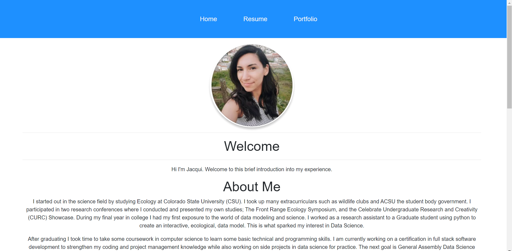

Footer Links

A user can navigate to the resume page which contains the resume document by:

Resume Page:

- Go to the "Resume" page by pressing Nav link

Navigation Top of Page
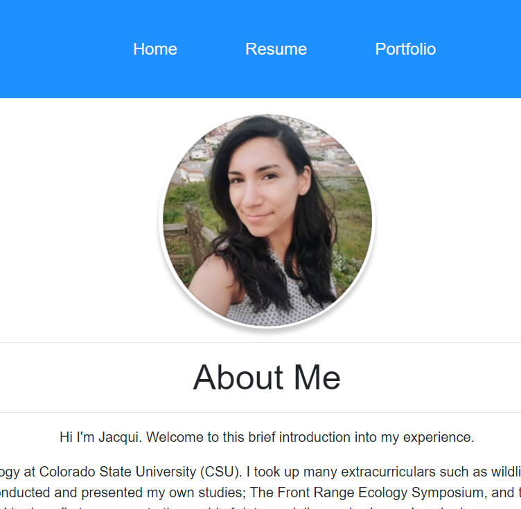

- Try scolling up and down to review the data.
- Try scrolling up and down within the iframe.
- try downloading the pdf in the iframe by pressing the download button.
- try printing the pdf in the iframe by pressing the print button.
- Try pressing the footer links to ensure they lead to the proper forms.

Resume page
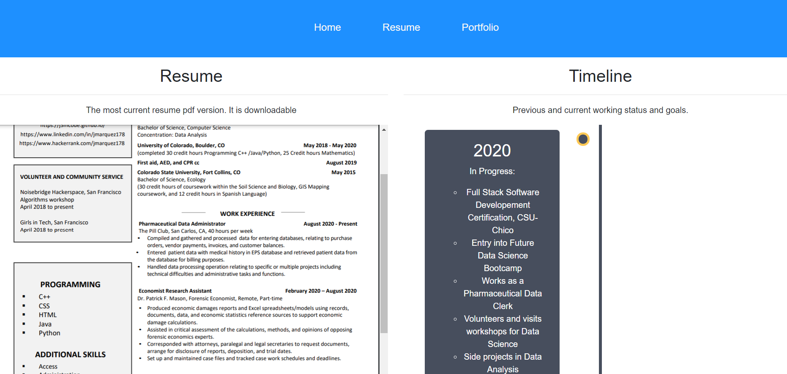

PDF Viewer

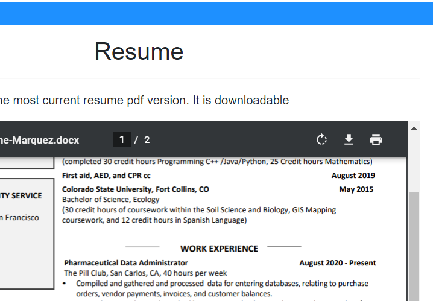

A user can navigate to the portfolio page by:

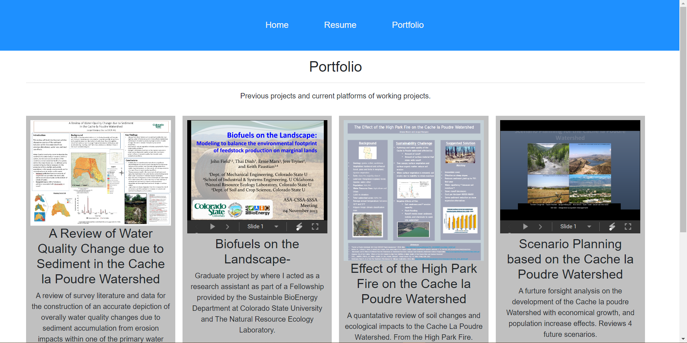

Portfolio Page:
- Go to the "Portfolio" page by pressing Nav link
- Try scolling up and down to review the data.
- Try pressing play/start/stop/next/back on the uploaded powerpoints.
- try pressing the link buttons in the additional work section to see if they navigate to new pages.
- Try pressing the footer links to ensure they lead to the proper forms.

BUGS

Some of the main user errors were the iframer viewer connection for the resume page.
For a while there was a connection error but this was resolved by using a different source url to host the pdf file.
The new viewer sources the pdf directly from uploaded files instead of a hosting site.

An additional common error was the elements positioning. Occasionally the margins would push elements to the left or right of the screen
This also made the translatability between desktop and mobile versions alter the image positions.
Images would be fixed to a certain size and go past the margin of certain mobile devices.

Normal view of Margins

By centering all elements, and maintaining a certain size boundary, the elements could remain in the center even while changing browser sizes.
To also fix the images error, the width element was changed from a fixed value to a responsive value, from pixels to width = 100% that would keep the image a certain size,
and placement, but also edit its size when changing to a different mobile device

Margins Error on Smaller device

Tested devices:
Each device setting was tested by moving the size of the screen responsively when inspecting the page element.

- Samsung Galaxy S8 – Android 8.0
- Samsung Galaxy S5 - Android 8.0
- iPhone 8 – iOS 11.4
- HP Laptop 15-bs0xx – Windows 10

Desktop Screen Test
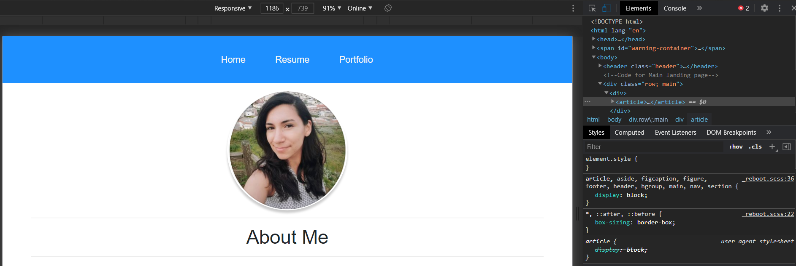

iPhone8 Screen Test
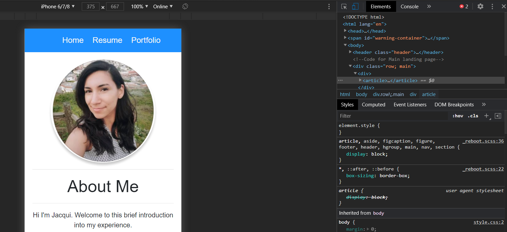

Deployment
--------------------------

To deploy my webpage, I used Github platform and the Gitpod workspaces. Through workspaces I would add files such as images or pdfs to use on
 the website and could edit individual files.
To access gitpod first a developer would have to visit my page repository at: https://github.com/J3mCode/J3mCode.github.io
The repository has a button on the top of the commits which links to Gitpod workspaces.

Main repository
 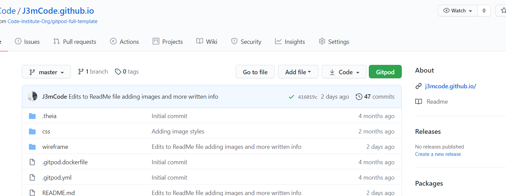

Once gitpod workspaces loads, a current workspace will be open with links to each uploaded file to the left.
 Images contained from the main page and additional website pages are located in the CSS > images file. All of these images are deployed within
  the live site. All other images contained for the readme were stored in the wireframe file.

Files Within Gitpod

 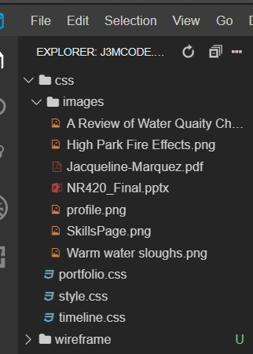

  From workspaces I drafted html files for each website page (home, resume and portfolio) and additionally created css pages for the individuals stylings.
  Each page has unique stylings for the individual needs of each page.
 
 HTML Files

  

The Code for each of the web pages are help within distint HTML files. All which refer to the style.css file for CSS stylings.
Specific to the resume page is an additional CSS file called timeline.css which has the CSS styling code for the timeline on the
resume page. It is unique to provide an interesting visual function to the page as well as basic infomation to supliment goals to
users/recruiting visitors to the site.

Timeline.CSS
  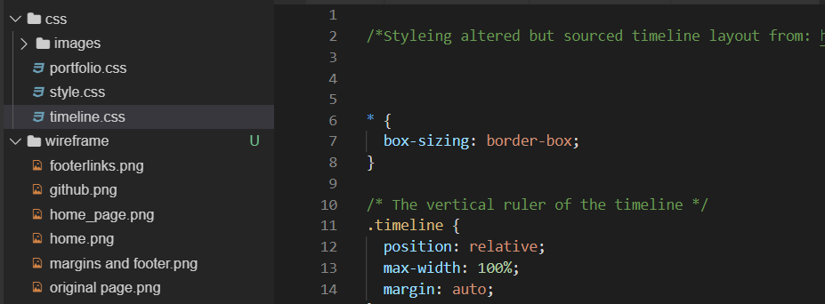

An Additional CSS styling is for the portfolio page. In portfolio.css the portfolio pages style is unique to provide previews of 
projects worked on and some information about each project. This allows visitors to the page to get a brief view of the type of work
I have in my experience as well as some preview of what future work may look like. Users of the site can also see links to sites I use
for practice in my work. The css styleing was used to be able to organize each of these projects in a ordered fashion but also consice.

Portfolio.CSS
  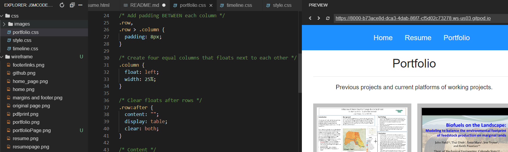

Credits
--------------------------
Content
- Footer sourced from Bootstrap styles: https://www.codeply.com/go/kTGlK9Axdk
- Styleing altered but sourced timeline layout from: https://www.w3schools.com/howto/howto_css_portfolio_gallery.asp
- images formatting sourced from Corlangs.com: http://www.corelangs.com/css/box/image-shadow.html
- Styleing altered but sourced timeline layout from: https://www.w3schools.com/howto/howto_css_timeline.asp

Media
- The photos used in this site were obtained from personal picture taken by Jacqueline Marquez

Acknowledgements
- I received inspiration for this project from:
- https://www.claudiatenhoope.com/nl/
- https://harrisonjansma.com/
- http://varianceexplained.org/r/trump-tweets/

  
